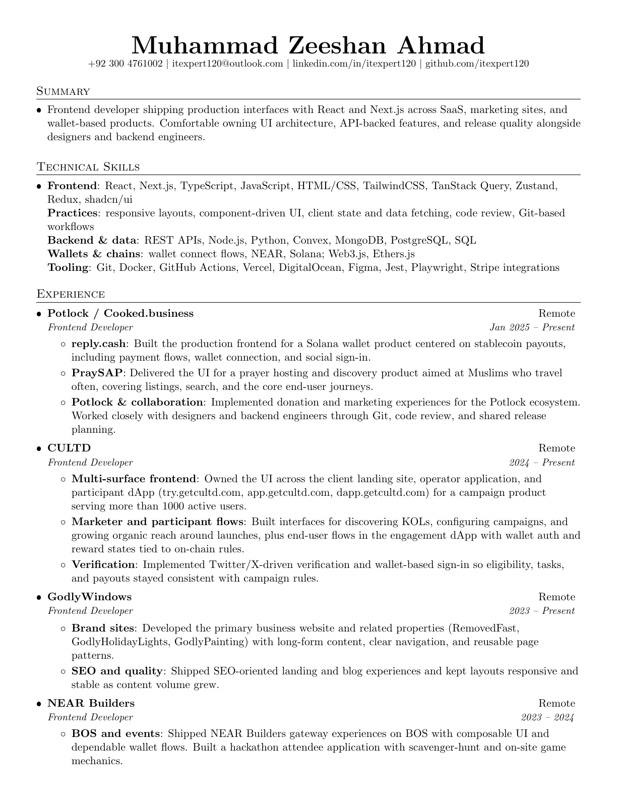

# Resume — Muhammad Zeeshan Ahmad

LaTeX resume (ATS-friendly, text-based PDF). **Source:** [`resume.tex`](resume.tex) · **Latest PDF:** [`resume.pdf`](resume.pdf)

## Preview

Click the image to open the PDF (or use the links above).

[](https://github.com/itexpert120/resume/blob/main/resume.pdf)

> **Note:** After you change `resume.tex`, rebuild `resume.pdf` and refresh `resume-preview.png` so the README matches (see [Build](#build)).

## Quick links (GitHub)

| File | View on GitHub |
|------|----------------|
| LaTeX source | [`resume.tex`](https://github.com/itexpert120/resume/blob/main/resume.tex) |
| PDF | [`resume.pdf`](https://github.com/itexpert120/resume/blob/main/resume.pdf) |
| Download PDF (raw) | [`resume.pdf` (raw)](https://github.com/itexpert120/resume/raw/main/resume.pdf) |

## Build

Requires a LaTeX distribution (TeX Live, MiKTeX, or MacTeX).

```bash
latexmk -pdf -interaction=nonstopmode resume.tex
```

Or with `pdflatex`:

```bash
pdflatex -interaction=nonstopmode resume.tex
```

Optional — update the README thumbnail (first page only; requires [Poppler](https://poppler.freedesktop.org/) `pdftoppm` or ImageMagick):

```bash
pdftoppm -png -f 1 -l 1 -r 150 resume.pdf resume-preview
move resume-preview-1.png resume-preview.png
```

## Customize

Edit `resume.tex` with your content. Keep section titles conventional (e.g. Experience, Education) for ATS parsers. Commit `resume.pdf` when you want the repo to show the latest export; auxiliary files are gitignored.

## License

See [LICENSE.md](LICENSE.md).
